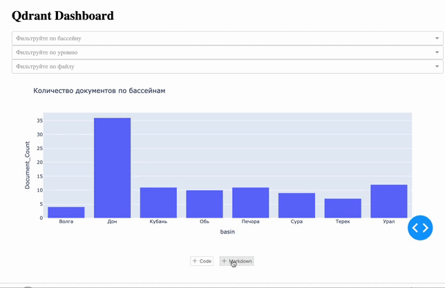

# 📚 SKIOVO Project: Data Processing & Analysis

Этот проект направлен на упрощение взаимодействия пользователей с **Схемами комплексного использования и охраны водных объектов** (СКИОВО) — подробными отчетами о состоянии более чем 70 речных бассейнов России. СКИОВО включают в себя следующие блоки:

- **Общая характеристика речного бассейна**: география, гидрология, геоморфология и климат.
- **Оценка экологического состояния**: выявление ключевых проблем и угроз.
- **Целевые показатели**: критерии, к которым необходимо стремиться для улучшения состояния водных ресурсов.
- **Водохозяйственные балансы**: данные о распределении водных ресурсов и балансах загрязняющих веществ.
- **Лимиты и квоты**: нормативы на забор воды и сброс сточных вод.
- **План мероприятий**: рекомендации по достижению целевого состояния речных бассейнов.

Проект **SKIOVO** автоматизирует предобработку, анализ и визуализацию этих данных, что делает их доступными и удобными для использования.

---

## 🗂 **Cтруктура проекта**

```plaintext
.
├── LICENSE                              # Лицензионное соглашение
├── README.md                            # Описание проекта
├── data                                 # Исходные и предобработанные данные
│   ├── Base_Books                       # PDF-книги, разбитые по речным бассейнам
│   ├── JSON                             # Исходные и предобработанные JSON-файлы
├── documents                            # ТЗ, промежуточные отчеты
├── notebooks                            # Jupyter ноутбуки для выполнения этапов проекта
│   ├── data_collection                  # Про сбор данных
│   ├── data_preprocessing               # Предобработка данных
│   ├── db_vectorization                 # Работа с векторными базами данных
│   ├── eda                              # Исследовательский анализ данных
│   ├── evaluation                       # Оценка моделей векторизации
│   ├── experiment_docling               # Эксперименты с Markdown
│   ├── experiment_structurization_pdf   # Эксперименты с PDF-структуризацией
│   └── getting_path                     # Объединение JSON с путями до PDF
├── poetry.lock                          # Зависимости проекта
├── pyproject.toml                       # Конфигурация проекта

```

## 🚀 Установка и запуск

### 1. **Клонирование репозитория**
```bash
git clone https://github.com/katimanova/skiovo.git
cd skiovo
```

### 2. Установка зависимостей и активация среды

Проект использует Poetry для управления зависимостями. Убедитесь, что он установлен (это важно, чтобы использовать нужные версии библиотек питона):
```bash
poetry install
poetry shell 
```
---

## 🛠 Ключевые этапы проекта

1. **📖 Анализ данных:**
   - В качестве исходного материала используется архив, содержащий данные восьми водных бассейнов: Волга, Дон, Кубань, Обь, Печора, Сура, Терек, Урал.  
   - **->** все отчеты хранятся на ифнормационных сайтах БВУ регионов[`./data_collection/collecting.ipynb`](notebooks/data_collection/collecting.ipynb).

2. **🧹 Предобработка данных:**
   - **Структуризация и преобразование**:
     - Данные структурированы в единый JSON и атомарные PDF-файлы для удобства работы и хранения. Подробнее в ноутбуке [`data_preprocessing/pdf_json_decomposer/script.ipynb`](notebooks/data_preprocessing/pdf_json_decomposer/script.ipynb).
   - **Подготовка к векторизации**:
     - Выполнена предобработка данных перед их векторизацией. Подробнее в [`db_vectorization/preprocessing_all_basin.ipynb`](notebooks/db_vectorization/preprocessing_all_basin.ipynb).

3. **📊 Анализ данных (EDA):**
   - Проведен исследовательский анализ данных, включающий:
     - Изучение содержимого отчетов по бассейнам.
     - Анализ частотности слов.
     - Визуализацию данных в формате облака слов.  
     Подробнее см. в [`./eda/eda.ipynb`](/eda/eda.ipynb).
     - Дашборд реализован на базе Plotly Dash - [`./eda/vector_db_dashboard.ipynb`](./eda/vector_db_dashboard.ipynb).

     

4. **🎯 Оценка методов для веткоризации текста:**
   - Из нескольких методов, выбран итоговый - `USER-bge-m3` от deepvk.[`./evaluation/metrics_model_emb.ipynb`](./evaluation/metrics_model_emb.ipynb)

| Модель                     | Метрика             | Результаты                                                                 | Подходит? |
|----------------------------|---------------------|----------------------------------------------------------------------------|-----------|
| **USER-bge-m3**            | cosine_similarity | 0.6997                                                        | Да        |
| **TF-IDF**                 | cosine_similarity |  0.3827                                                        | Да        |
| **Sci-Rus-Tiny**           | cosine_similarity | 0.6394                                                        | Нет (выдал не то)       |


5. **🗃 Создание векторной базы данных:**
   - **Векторизация данных**:
     - Выполнена векторизация и размещение данных в локальной базе Qdrant. Подробности в [`notebooks/db_vectorization/vectorization_all.ipynb`](notebooks/db_vectorization/vectorization_all.ipynb).
   - **Оценка качества векторных данных**:
     - Проведена оценка данных на основе метрик качества. Подробности см. в [`notebooks/evaluation/metrics.ipynb`](notebooks/evaluation/metrics.ipynb).
     
6. **Прототип rule-based бот**

---

## 🎯 Бизнес-ценность

Проект **SKIOVO** автоматизирует обработку и анализ данных из отчетов о водных ресурсах России (СКИОВО). Это позволяет:

1. **Ускорить доступ к данным**:  
   - Структурированные данные и векторная база упрощают поиск и анализ информации.

2. **Подготовить основу для вопросно-ответной системы**:  
   - Векторизация данных и прототип бота закладывают фундамент для будущей платформы, которая упростит взаимодействие с данными для водопользователей.

Проект является частью инициативы по цифровизации, направленной на повышение эффективности работы с водными ресурсами.

---
